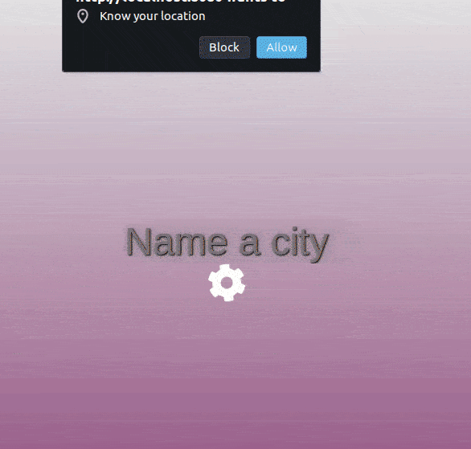

# weather web-app
> This is a weather web-app that can retrieve the current weather for your current city or the one you type.

<p align="center">
  
</p>

In this project, I use async functions to get data from the following sources:

- [OpenWeather](https://openweathermap.org/api)
- [Unsplash](https://unsplash.com/developers)
- [Google Geolocation](https://developers.google.com/maps/documentation/geolocation/overview)

To let the app know your current city, enable the location permission on your browser, by default you will be asked the first time you load the page. 


## Live Demo
I will feel honored if you try my app and tell me how to improve it.
It is hosted on a Netlify Free account so be patient, sometimes it takes a while to load.
[weather-app](https://everyweather.netlify.com)

## Built With

- JavaScript
- Webpack, dotenv-webpack
- HTML, CSS
- Deploy on [Netlify](https://www.netlify.com)

## Deploy

1. To deploy this project locally, download or clone this repo, request your own API keys and save them in a *.env* file, with the following names:
```
    OW_API_KEY = #########
    GOOGLE_GEO_API_KEY = #########
    GOOGLE_NAM_API_KEY = #########
    UNSPLASH_ACCESS = #########
    UNSPLASH_SECRET = #########
```
2. Install the dependencies to build the project
```
    npm install
```
3. Build the project with *npm run build* use the following command to start the development server :
```
    npm run start
```
4. If you make are making many changes use webpack on development mode:
```
    $ npm run dev
```
## Future features

- Show forecast for next days
- Improve responsiveness
- Add footer with about and social media links

## Author

👤 Franco Rosa

- Github: [@FrancoRosa](https://github.com/FrancoRosa)
- Linkedin: [Franco Rosa](https://www.linkedin.com/in/francoro)

## 🤝 Contributing

Contributions, issues and feature requests are welcome!
Feel free to check the [issues page](issues/).

## Show your support

Give an ⭐️ if you like this project!

## Acknowledgments

- [Unsplash](https://unsplash.com) for the images I use in this project.
- [OpenWeather](https://openweathermap.org) for the weather data shown in this project.
- [Google Maps Plataform](https://developers.google.com/maps/documentation) for the autocomplete feature and the ability to get the device's location.
- [Dotenv](https://www.npmjs.com/package/dotenv-webpack) Nice plugin to hide API keys.
- Team #94 Capricornus Microverse, for the morning code reviews.

## 📝 License

This project is [MIT](lic.url) licensed.
